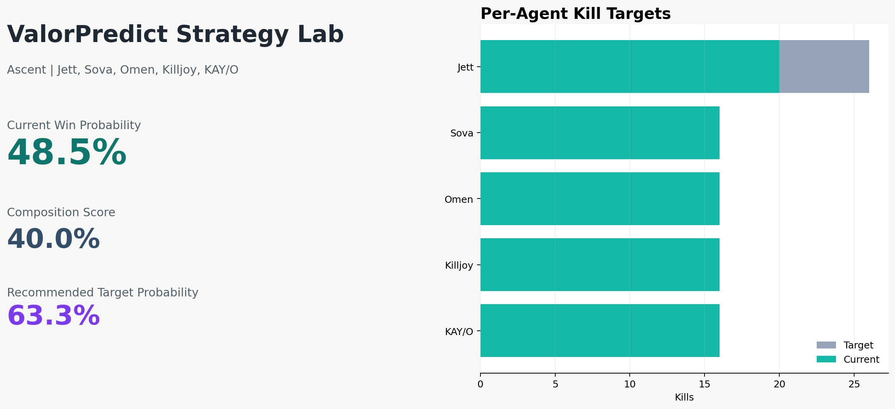
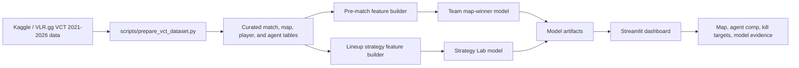
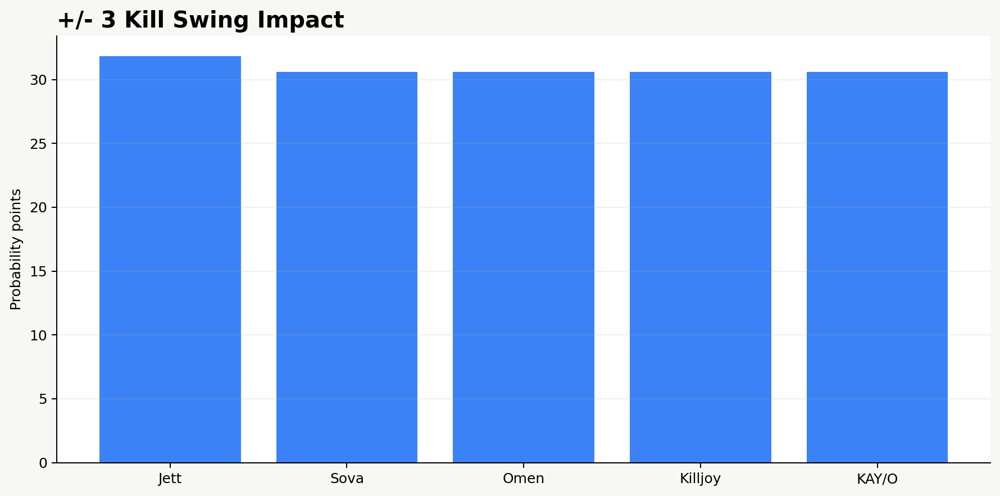
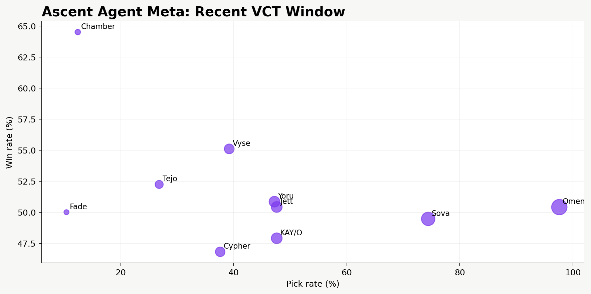

# ValorPredict

ValorPredict is a Streamlit and scikit-learn analytics project for Valorant lineup strategy. It uses professional VCT history to simulate how map choice, five-agent compositions, and per-agent kill targets change a team's modeled win probability.



## Live Demo

The app is deployment-ready for Streamlit Community Cloud, Render, or Docker. A public demo URL should be added here after the app is connected to a hosting account:

- Live app: pending public deployment
- Current Streamlit URL: [ayush141910-valorpredict-app-m2xgzx.streamlit.app](https://ayush141910-valorpredict-app-m2xgzx.streamlit.app)
- One-click Streamlit setup: [deploy from this GitHub repo](https://share.streamlit.io/deploy?repository=https://github.com/Ayush141910/valorpredict&branch=main&mainModule=app.py)
- Deployment guide: [docs/deployment.md](docs/deployment.md)

## Project Status

The original prototype used a tiny duplicated CSV and a single random forest. This version rebuilds the project around a real VCT dataset, a strategy simulator, leak-aware pre-match modeling, model benchmarking, and an interactive analytics dashboard.

Current engineering foundation:

- curated VCT 2021-2026 dataset sourced from Kaggle/VLR.gg
- Strategy Lab that lets a user choose a map, five agents, current kills, and a target win probability
- model-based per-agent kill target recommendations for the selected composition
- composition strength score with exact-sample and low-confidence warnings
- role-aware lineup analysis across Duelist, Initiator, Controller, and Sentinel agents
- kill sensitivity simulator showing which player's extra kills move win probability most
- map meta and selected-pair synergy tables for agent planning
- side-by-side scenario comparison for alternate compositions
- opponent-aware pressure comparison
- player profile mode for role-specific agent recommendations
- recent-meta window controls for 2025-2026 weighted exploration
- probability calibration report for the strategy model
- deployment-ready Streamlit configuration, Procfile, and Dockerfile
- sequential pre-match feature engineering with team form, map form, head-to-head form, round differential, and Elo-style strength
- benchmark suite across baseline, logistic regression, random forest, extra trees, gradient boosting, histogram gradient boosting, AdaBoost, and KNN
- honest time-based evaluation: train on 2021-2024, validate on 2025, test on 2026
- Streamlit dashboard for lineup strategy, pre-match prediction, model comparison, VCT exploration, and player stats
- reproducible data prep and model training scripts

## Project Structure

```text
app.py
train_model.py
train_strategy_model.py
Dockerfile
Procfile
.streamlit/config.toml
data/external/vct_2021_2026/
data/processed/vct_map_features.csv
data/processed/vct_lineup_strategy_features.csv
artifacts/valorpredict_model.joblib
artifacts/strategy_model.joblib
reports/model_report.md
reports/model_comparison.csv
reports/strategy_model_report.md
reports/strategy_model_comparison.csv
reports/strategy_model_card.md
reports/pre_match_model_card.md
reports/strategy_calibration.csv
reports/strategy_calibration_report.md
reports/metrics.json
docs/architecture.md
docs/deployment.md
docs/assets/
scripts/prepare_vct_dataset.py
scripts/generate_project_assets.py
src/valorpredict/strategy_modeling.py
src/valorpredict/vct_modeling.py
tests/test_pipeline.py
```

## Architecture



## Run Locally

```bash
python -m venv .venv
source .venv/bin/activate
pip install -r requirements.txt
python train_model.py
python train_strategy_model.py
python scripts/generate_project_assets.py
streamlit run app.py
```

## Data

The current production-grade source dataset lives in `data/external/vct_2021_2026/`.
It is a compact extract from Ryan Luong's Kaggle dataset, `ryanluong1/valorant-champion-tour-2021-2023-data`, which is MIT licensed and sourced from VLR.gg. The Kaggle URL slug still says `2021-2023-data`, the current Kaggle title says `2021-2025 Data`, and the downloaded archive also contains `vct_2026`. This project curates VCT 2021-2026 because those folders are present in the source archive.

Included extracts:

- `matches.csv`: match-level winners and series scores
- `maps.csv`: map-level results, side scores, duration, and map winners
- `player_map_stats.csv.gz`: player-map performance stats
- `team_agent_compositions.csv.gz`: team agent composition and map-level win/loss aggregates

Rebuild the curated dataset:

```bash
python scripts/prepare_vct_dataset.py
```

## Validate

```bash
python -m compileall app.py train_model.py train_strategy_model.py scripts src tests
python -m unittest discover -s tests
```

## Modeling

### Strategy Lab

The primary project experience is a lineup simulator:

- select a map such as Ascent
- select five agents such as Jett, Sova, Omen, Killjoy, and KAY/O
- enter current or expected kills for each agent
- set a target win probability
- receive model-based minimum kill targets per agent
- inspect comp strength, role balance, sample-size confidence, map meta, pair synergy, and probability sensitivity

This model intentionally uses in-game kill lines, so it is not a pre-match betting model. It answers: given this composition and these performance targets, how often did similar professional VCT team-map examples convert into wins?

Current best strategy model: Gradient Boosting.

Current 2026 strategy holdout performance:

- Accuracy: 86.9%
- Balanced accuracy: 86.9%
- ROC AUC: 95.5%

### Pre-Match Model

This version can honestly claim:

- built a reproducible pre-match map winner classifier
- benchmarked multiple model families on a time-based split
- used 2026 as a forward-looking holdout set
- avoided post-match leakage from final scores and player performance stats
- shipped model metadata, comparison reports, and a dashboard

Current best model: AdaBoost.

Current 2026 holdout performance:

- Accuracy: 56.2%
- Balanced accuracy: 56.4%
- ROC AUC: 55.4%

The holdout result is intentionally reported as modest. Professional Valorant outcomes are noisy, rosters shift, and this model avoids cheating with post-match stats.

## Product Features

- **Strategy Lab:** choose map, agents, kill lines, and target probability
- **Role-Aware Targets:** show agent role next to current and recommended kill lines
- **Composition Strength:** score the selected comp using exact-composition history and blended agent-map evidence
- **Sensitivity Analysis:** show how +1, +3, and +5 kills per agent affect probability
- **Map Meta:** show high-performing agents on the selected map
- **Pair Synergy:** show how selected agent pairs performed together historically
- **Scenario Comparison:** compare the current comp against an alternate five-agent setup
- **Opponent Pressure:** compare the selected team comp against an enemy comp idea
- **Player Profile Mode:** recommend agents based on preferred role and current map
- **Recent Meta Window:** filter exploratory evidence to recent VCT seasons
- **Calibration View:** compare predicted probability bins against observed holdout results
- **Model Transparency:** model cards, architecture notes, and leakage/limitation warnings





## Documentation

- [Architecture](docs/architecture.md)
- [Deployment](docs/deployment.md)
- [Strategy Model Card](reports/strategy_model_card.md)
- [Pre-Match Model Card](reports/pre_match_model_card.md)
- [Strategy Calibration Report](reports/strategy_calibration_report.md)
