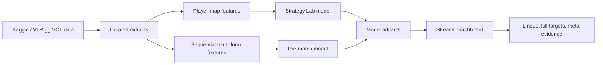

# ValorPredict

[](https://github.com/Ayush141910/valorpredict/actions/workflows/ci.yml)
[](https://valorpredict.streamlit.app/)
[](https://www.python.org/)
[](https://streamlit.io/)
[](https://scikit-learn.org/)

ValorPredict is a Valorant esports strategy simulator built from professional VCT match history. It lets a user choose a map, build a five-agent composition, set expected per-agent kill lines, and inspect how those choices change modeled map win probability.


## Why This Project Exists

Most esports prediction projects stop at "Team A beats Team B." ValorPredict is built around a more useful question for players and analysts:

> Given this map, this agent composition, and these performance targets, what does historical VCT data suggest about our chance to win?

The project is designed to show the product thinking behind an ML-backed analytics tool:

- strategy simulation instead of a black-box prediction demo
- role-aware kill targets for Duelists, Initiators, Controllers, and Sentinels
- sample-size and confidence warnings for rare compositions
- sensitivity analysis that shows which player's extra kills move probability most
- a second leak-aware pre-match model to show disciplined validation
- public deployment, model cards, architecture notes, and automated tests

## Live Demo

Dashboard: [https://valorpredict.streamlit.app/](https://valorpredict.streamlit.app/)

The hosted demo runs the committed model artifacts and curated VCT extracts. No retraining is required at app startup.


## What Reviewers Can Inspect Quickly

- **Strategy Lab:** map selection, five-agent lineup builder, kill targets, comp score, role balance, and sample-size confidence
- **Model drivers:** per-agent upside and downside impact from kill swings
- **Meta analysis:** map-specific agent pick rate, win rate, average kills, and selected-pair synergy
- **Scenario planning:** alternate composition comparison, opponent pressure, and player profile recommendations
- **Modeling discipline:** time-based validation, calibration report, model cards, and leakage notes
- **Engineering:** reproducible training scripts, GitHub Actions CI, Streamlit deployment config, and deterministic tests

## Overview

The project connects six pieces of a practical esports analytics workflow:

- curated VCT data extraction
- team-map and player-map feature engineering
- lineup strategy modeling
- pre-match benchmark modeling
- model artifact and report generation
- Streamlit decision-support dashboard

The Strategy Lab is intentionally outcome-conditioned on kill lines. It is not a betting model. It is a scenario simulator that answers how similar professional team-map examples performed when a composition and performance profile were present.

## Architecture



## Demo

Open the hosted dashboard:

```text
https://valorpredict.streamlit.app/
```

Run locally:

```bash
python -m venv .venv
source .venv/bin/activate
pip install -r requirements.txt
streamlit run app.py
```

What to try:

- choose `Ascent default meta`
- adjust Jett, Sova, Omen, Killjoy, and KAY/O kill lines
- compare current probability against the recommended target
- open `Sensitivity` to see which agent's extra kills matter most
- open `Map Meta` to inspect recent VCT agent trends
- open `Opponent` to compare pressure against an enemy comp idea
- open `Models` to inspect benchmark and calibration results

## Capabilities

- Builds a Strategy Lab dataset from professional player-map and map-outcome records.
- Recommends per-agent kill targets for a selected map and composition.
- Scores composition strength with exact-sample and blended agent-map evidence.
- Flags rare compositions with confidence warnings.
- Shows role balance across Duelist, Initiator, Controller, and Sentinel picks.
- Estimates probability lift from +1, +3, and +5 kill scenarios.
- Compares an alternate comp against the current comp.
- Models opponent pressure using enemy comp and historical kill baselines.
- Recommends agents from a player's preferred role and agent pool.
- Benchmarks multiple model families on time-based 2021-2026 splits.
- Keeps the pre-match model separate from the kill-line simulator to avoid misleading claims.

## Modeling

### Strategy Lab

The Strategy Lab estimates map win probability from map, five agents, expected rounds, and per-agent kill lines.

Current best strategy model: Gradient Boosting.

2026 holdout performance:

- Accuracy: 86.9%
- Balanced accuracy: 86.9%
- ROC AUC: 95.5%

This model uses in-game kill lines by design. It should be read as a planning simulator, not a pre-match guarantee.

### Pre-Match Benchmark

The pre-match model predicts whether Team A wins a professional map using only context and historical form available before that map.

Current best pre-match model: AdaBoost.

2026 holdout performance:

- Accuracy: 56.2%
- Balanced accuracy: 56.4%
- ROC AUC: 55.4%

The modest score is intentionally reported. Professional Valorant outcomes are noisy, and this model avoids post-match leakage from scores or player statistics.

## Data

The production dataset lives in `data/external/vct_2021_2026/`.

It is a compact extract from Ryan Luong's Kaggle dataset, `ryanluong1/valorant-champion-tour-2021-2023-data`, sourced from VLR.gg. The source archive includes VCT folders through 2026, so this project documents the curated extract as VCT 2021-2026.

Included extracts:

- `matches.csv`: match-level winners and series scores
- `maps.csv`: map-level results, side scores, duration, and map winners
- `player_map_stats.csv.gz`: player-map performance stats
- `team_agent_compositions.csv.gz`: team-agent composition aggregates

Generated files such as `data/processed/vct_map_features.csv` and `reports/metrics.json` are intentionally not committed. They are recreated by `python train_model.py` when needed.

## Repository Layout

```text
app.py
train_model.py
train_strategy_model.py
artifacts/
  strategy_model.joblib
  valorpredict_model.joblib
data/
  external/vct_2021_2026/
  processed/vct_lineup_strategy_features.csv
docs/
  architecture.md
  deployment.md
  assets/
reports/
  model_report.md
  pre_match_model_card.md
  strategy_model_report.md
  strategy_model_card.md
  strategy_calibration_report.md
scripts/
  prepare_vct_dataset.py
  generate_project_assets.py
src/valorpredict/
  strategy_modeling.py
  vct_modeling.py
tests/
  test_pipeline.py
```

## Local Commands

Run the app:

```bash
streamlit run app.py
```

Run tests:

```bash
python -m unittest discover -s tests
```

Run compile checks:

```bash
python -m compileall app.py train_model.py train_strategy_model.py scripts src tests
```

Rebuild the curated VCT extract:

```bash
python scripts/prepare_vct_dataset.py
```

Retrain the pre-match model:

```bash
python train_model.py
```

Retrain the Strategy Lab model:

```bash
python train_strategy_model.py
```

Regenerate README visuals and calibration output:

```bash
python scripts/generate_project_assets.py
```

## Design Notes

The project keeps two modeling tasks separate because they answer different questions. The Strategy Lab uses per-agent kill lines for player-facing scenario planning. The pre-match model avoids post-match data and exists as a leakage-aware benchmark.

Model outputs are presented with caveats: rare comps get confidence warnings, probability calibration is shown, and the README reports modest pre-match results instead of overstating predictive power.

In a production version, the current static artifacts could become:

- scheduled VCT data refreshes
- patch-aware meta windows
- roster-aware team features
- MLflow model registry
- SHAP explanations for model drivers
- warehouse-backed dashboard queries
- user-saved lineup scenarios

Additional notes:

- [docs/architecture.md](docs/architecture.md)
- [docs/deployment.md](docs/deployment.md)
- [reports/strategy_model_card.md](reports/strategy_model_card.md)
- [reports/pre_match_model_card.md](reports/pre_match_model_card.md)
- [reports/strategy_calibration_report.md](reports/strategy_calibration_report.md)


