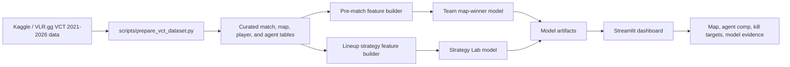

# ValorPredict Architecture

## Design Notes

- The pre-match model avoids final score and player stat leakage by using only historical team form before each map.
- The Strategy Lab intentionally uses per-agent kill lines because the product question is planning and simulation, not pre-match betting.
- Strategy recommendations include sample-size and composition-confidence warnings so rare comps are not over-presented as certain.
- Model artifacts are committed with pinned dependency versions so recruiters can run the app without retraining the full benchmark suite.
